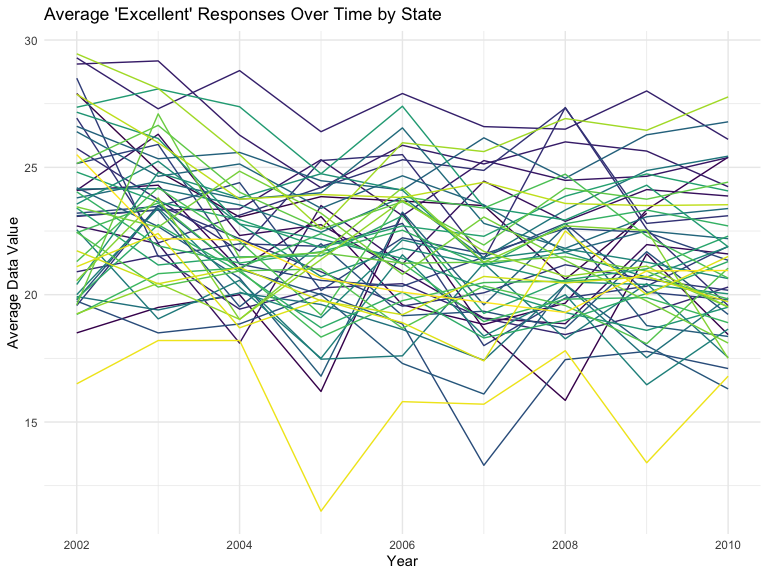
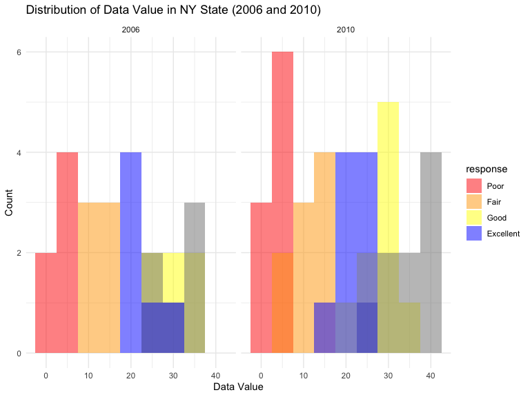
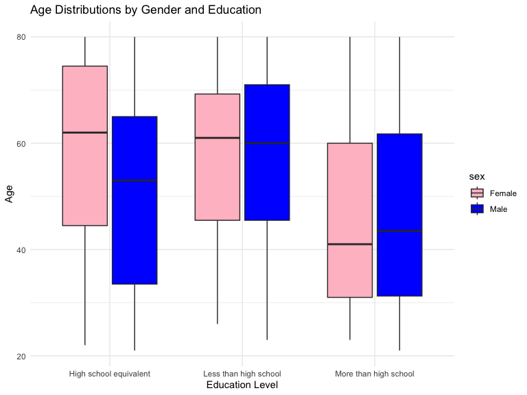
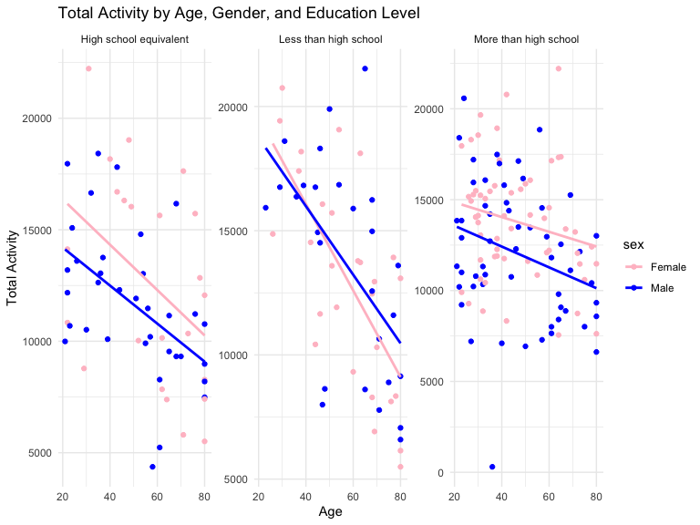
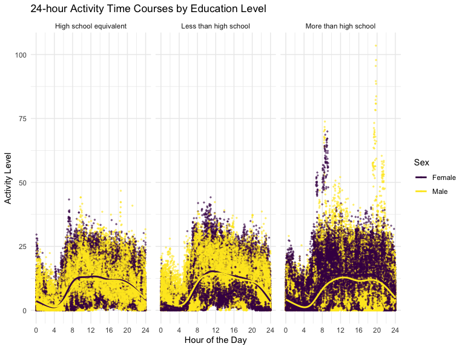

p8105_hw3_anw2158
================
Aung Nay Win
2023-10-12

#### Problem 1

## Answer questions about the data

This dataset contains 1384617 rows and 15 columns, with each row
resprenting a single product from an instacart order. Variables include
identifiers for user, order, and product; the order in which each
product was added to the cart. There are several order-level variables,
describing the day and time of the order, and number of days since prior
order. Then there are several item-specific variables, describing the
product name (e.g. Yogurt, Avocado), department (e.g. dairy and eggs,
produce), and aisle (e.g. yogurt, fresh fruits), and whether the item
has been ordered by this user in the past. In total, there are 39123
products found in 131209 orders from 131209 distinct users.

Below is a table summarizing the number of items ordered from aisle. In
total, there are 134 aisles, with fresh vegetables and fresh fruits
holding the most items ordered by far.

``` r
instacart |> 
  count(aisle) |> 
  arrange(desc(n))
```

    ## # A tibble: 134 × 2
    ##    aisle                              n
    ##    <chr>                          <int>
    ##  1 fresh vegetables              150609
    ##  2 fresh fruits                  150473
    ##  3 packaged vegetables fruits     78493
    ##  4 yogurt                         55240
    ##  5 packaged cheese                41699
    ##  6 water seltzer sparkling water  36617
    ##  7 milk                           32644
    ##  8 chips pretzels                 31269
    ##  9 soy lactosefree                26240
    ## 10 bread                          23635
    ## # ℹ 124 more rows

Next is a plot that shows the number of items ordered in each aisle.
Here, aisles are ordered by ascending number of items.

``` r
instacart |> 
  count(aisle) |> 
  filter(n > 10000) |> 
  mutate(aisle = fct_reorder(aisle, n)) |> 
  ggplot(aes(x = aisle, y = n)) + 
  geom_point() + 
  labs(title = "Number of items ordered in each aisle") +
  theme(axis.text.x = element_text(angle = 60, hjust = 1))
```


Our next table shows the three most popular items in aisles
`baking ingredients`, `dog food care`, and `packaged vegetables fruits`,
and includes the number of times each item is ordered in your table.

``` r
instacart |> 
  filter(aisle %in% c("baking ingredients", "dog food care", "packaged vegetables fruits")) |>
  group_by(aisle) |> 
  count(product_name) |> 
  mutate(rank = min_rank(desc(n))) |> 
  filter(rank < 4) |> 
  arrange(desc(n)) |>
  knitr::kable()
```

| aisle                      | product_name                                  |    n | rank |
|:---------------------------|:----------------------------------------------|-----:|-----:|
| packaged vegetables fruits | Organic Baby Spinach                          | 9784 |    1 |
| packaged vegetables fruits | Organic Raspberries                           | 5546 |    2 |
| packaged vegetables fruits | Organic Blueberries                           | 4966 |    3 |
| baking ingredients         | Light Brown Sugar                             |  499 |    1 |
| baking ingredients         | Pure Baking Soda                              |  387 |    2 |
| baking ingredients         | Cane Sugar                                    |  336 |    3 |
| dog food care              | Snack Sticks Chicken & Rice Recipe Dog Treats |   30 |    1 |
| dog food care              | Organix Chicken & Brown Rice Recipe           |   28 |    2 |
| dog food care              | Small Dog Biscuits                            |   26 |    3 |

Finally is a table showing the mean hour of the day at which Pink Lady
Apples and Coffee Ice Cream are ordered on each day of the week. This
table has been formatted in an untidy manner for human readers. Pink
Lady Apples are generally purchased slightly earlier in the day than
Coffee Ice Cream, with the exception of day 5.

``` r
instacart |>
  filter(product_name %in% c("Pink Lady Apples", "Coffee Ice Cream")) |>
  group_by(product_name, order_dow) |>
  summarize(mean_hour = mean(order_hour_of_day)) |>
  pivot_wider(
    names_from = order_dow, 
    values_from = mean_hour) |>
  knitr::kable(digits = 2)
```

    ## `summarise()` has grouped output by 'product_name'. You can override using the
    ## `.groups` argument.

| product_name     |     0 |     1 |     2 |     3 |     4 |     5 |     6 |
|:-----------------|------:|------:|------:|------:|------:|------:|------:|
| Coffee Ice Cream | 13.77 | 14.32 | 15.38 | 15.32 | 15.22 | 12.26 | 13.83 |
| Pink Lady Apples | 13.44 | 11.36 | 11.70 | 14.25 | 11.55 | 12.78 | 11.94 |

#### Problem 2

``` r
brfss_df =
  brfss_smart2010 %>% 
  janitor::clean_names() %>% 
  filter(topic == "Overall Health", 
         response %in% c("Poor", "Fair", "Good", "Very good", "Excellent"))%>%
  mutate(response= factor(response, levels = c("Poor", "Fair", "Good", "Very good"  ,"Excellent"), ordered = TRUE)) %>% 
  arrange(response)
```

States that were observed at 7 or more locations in 2002

``` r
brfss_df %>% 
  filter(year == 2002) %>%
    group_by(locationabbr) %>%
    summarise(locations = n()) %>%
    filter(locations >= 7)
```

    ## # A tibble: 36 × 2
    ##    locationabbr locations
    ##    <chr>            <int>
    ##  1 AZ                  10
    ##  2 CO                  20
    ##  3 CT                  35
    ##  4 DE                  15
    ##  5 FL                  35
    ##  6 GA                  15
    ##  7 HI                  20
    ##  8 ID                  10
    ##  9 IL                  15
    ## 10 IN                  10
    ## # ℹ 26 more rows

States that were observed at 7 or more locations in 2010

``` r
brfss_df %>% 
  filter(year == 2010) %>%
    group_by(locationabbr) %>%
    summarise(locations = n()) %>%
    filter(locations >= 7)
```

    ## # A tibble: 45 × 2
    ##    locationabbr locations
    ##    <chr>            <int>
    ##  1 AL                  15
    ##  2 AR                  15
    ##  3 AZ                  15
    ##  4 CA                  60
    ##  5 CO                  35
    ##  6 CT                  25
    ##  7 DE                  15
    ##  8 FL                 205
    ##  9 GA                  20
    ## 10 HI                  20
    ## # ℹ 35 more rows

``` r
brfss_df %>%
    filter(response == "Excellent") %>%
    group_by(year, locationabbr) %>% 
    summarise(avg_data_value = mean(data_value, na.rm = TRUE)) %>% 
  ggplot(aes(x=year,y=avg_data_value, group=locationabbr, color=locationabbr))+
  geom_line() +
    labs(title = "Average 'Excellent' Responses Over Time by State",
         x = "Year",
         y = "Average Data Value") +
    theme_minimal() +
    theme(legend.position = "none") 
```

    ## `summarise()` has grouped output by 'year'. You can override using the
    ## `.groups` argument.



``` r
ny_df= brfss_df %>%
    filter(year %in% c(2006, 2010), 
           locationabbr == "NY", 
           response %in% c("Poor", "Fair", "Good", "Very good", "Excellent"))
ggplot(ny_df, aes(x = data_value, fill = response)) +
    geom_histogram(binwidth = 5, position = "identity", alpha = 0.5) +
    facet_wrap(~ year) +
    labs(title = "Distribution of Data Value in NY State (2006 and 2010)",
         x = "Data Value",
         y = "Count") +
    scale_fill_manual(values = c("Poor" = "red", "Fair" = "orange", "Good" = "yellow", "Very Good" = "green", "Excellent" = "blue")) +
    theme_minimal()
```



#### Problem 3

``` r
demogrpahic_df = read_csv("data/nhanes_covar.csv", skip = 4) %>% 
  janitor::clean_names()%>% 
  filter(age >= 21) %>% 
  drop_na()
```

    ## Rows: 250 Columns: 5
    ## ── Column specification ────────────────────────────────────────────────────────
    ## Delimiter: ","
    ## dbl (5): SEQN, sex, age, BMI, education
    ## 
    ## ℹ Use `spec()` to retrieve the full column specification for this data.
    ## ℹ Specify the column types or set `show_col_types = FALSE` to quiet this message.

``` r
accelarometer_df = read_csv("data/nhanes_accel.csv") %>% 
  janitor::clean_names()
```

    ## Rows: 250 Columns: 1441
    ## ── Column specification ────────────────────────────────────────────────────────
    ## Delimiter: ","
    ## dbl (1441): SEQN, min1, min2, min3, min4, min5, min6, min7, min8, min9, min1...
    ## 
    ## ℹ Use `spec()` to retrieve the full column specification for this data.
    ## ℹ Specify the column types or set `show_col_types = FALSE` to quiet this message.

``` r
merged_df= demogrpahic_df %>% 
  inner_join(accelarometer_df, by = "seqn") %>% 
  mutate(sex = recode (sex, "1"= "Male", "2"="Female" ), 
    education = recode(education, 
                          "1" = "Less than high school", 
                          "2" = "High school equivalent", 
                          "3" = "More than high school")
    )
```

``` r
merged_df %>% 
  count(education, sex) %>% 
  pivot_wider(
    names_from = sex,
    values_from = n) %>% 
  arrange(education) %>% 
  knitr::kable(digits = 2)
```

| education              | Female | Male |
|:-----------------------|-------:|-----:|
| High school equivalent |     23 |   35 |
| Less than high school  |     28 |   27 |
| More than high school  |     59 |   56 |

``` r
ggplot(merged_df, aes(x = education, y = age, fill = sex)) +
  geom_boxplot() +
  labs(title = "Age Distributions by Gender and Education",
       x = "Education Level",
       y = "Age") +
  theme_minimal() +
  scale_fill_manual(values = c("Male" = "blue", "Female" = "pink"))
```



From graph, the female is older than male at the education level of high
school equivalent. The age of male and female is approximately equal at
the education level of less than high school. The male is older than
female at the education level of more than high school.

``` r
total_activity_df = merged_df %>%
  pivot_longer(cols = starts_with("min"), 
               names_to = "minute", 
               values_to = "activity") %>% 
  group_by(seqn) %>%
  summarise(total_activity = sum(activity, na.rm = TRUE))
```

``` r
final_df= total_activity_df %>% 
  inner_join(demogrpahic_df, by = "seqn") %>% 
  mutate(sex = recode (sex, "1"= "Male", "2"="Female" ), 
    education = recode(education, 
                          "1" = "Less than high school", 
                          "2" = "High school equivalent", 
                          "3" = "More than high school")
    )

ggplot(final_df, aes(x = age, y = total_activity, color = sex)) +
  geom_point() +
  geom_smooth(method = "lm", se = FALSE) + 
  facet_wrap(~ education, scales = "free_y") +
  labs(title = "Total Activity by Age, Gender, and Education Level",
       x = "Age",
       y = "Total Activity") +
  theme_minimal() +
  scale_color_manual(values = c("Male" = "blue", "Female" = "pink"))
```

    ## `geom_smooth()` using formula = 'y ~ x'



In the high school equivalent education plot, both males and females
show a decrease in total activity as they age. Females have higher
activity levels throughout adulthood compared to males in this education
category. For the less than high school education plot, both genders
experience a decrease in total activity as they age. There’s a notable
crossover at age 40 where males, initially less active, become more
active than females. For the third plot which is more than high school
education, the pattern of decreasing activity with age persists. Again,
females exhibit higher activity levels compared to males, similar to the
first category.

``` r
long_df= merged_df %>%
  pivot_longer(cols = starts_with("min"), 
               names_to = "minute", 
               values_to = "activity") %>%
  mutate(hour = as.numeric(str_replace(minute, "min", "")) / 60)

ggplot(long_df, aes(x = hour, y = activity, color = sex)) +
  geom_point(alpha=.5, size=.5) +
  geom_smooth(se = FALSE) +
  facet_wrap(~ education) +  
  labs(
    title = "24-hour Activity Time Courses by Education Level",
    x = "Hour of the Day",
    y = "Activity Level",
    color = "Sex"
  ) +
  scale_x_continuous(breaks = seq(0, 24, 4)) + 
  theme_minimal()
```

    ## `geom_smooth()` using method = 'gam' and formula = 'y ~ s(x, bs = "cs")'



From the three graphs, the activity level of both male and female is the
lowest during 4 hr of the day and the activity level reaches at the peak
around 8 hr of the day and decreases after that. Moreover, the female
activilty level is higher than male one based on the three plots.
